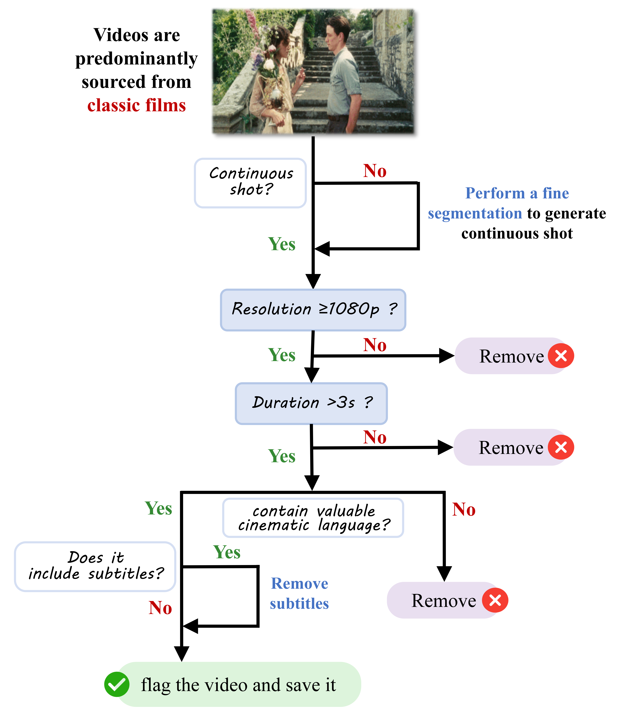
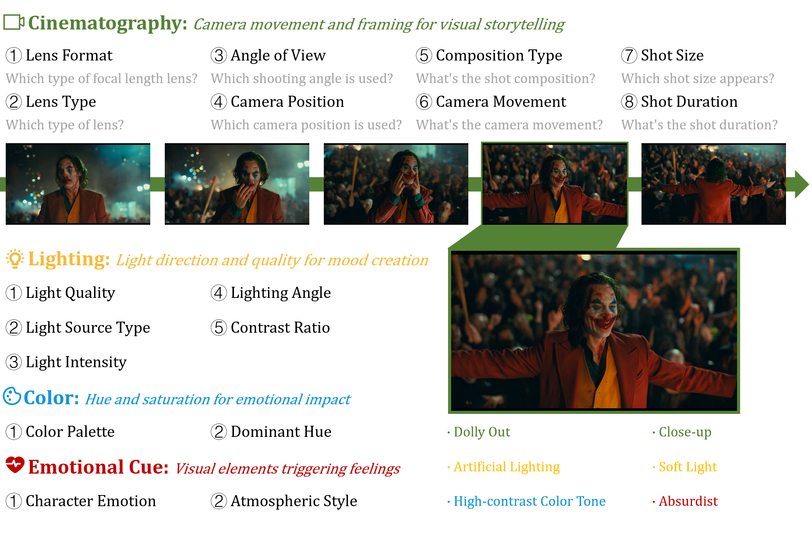
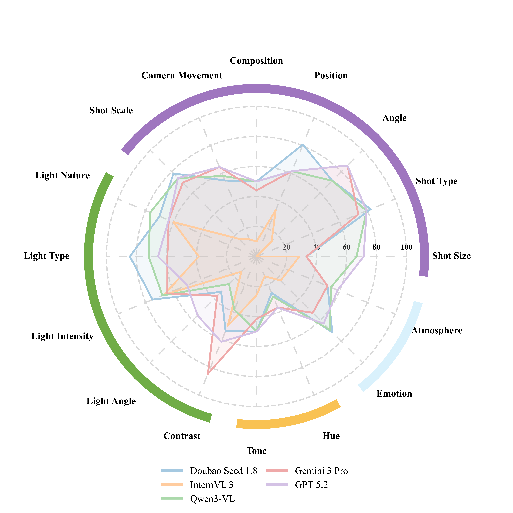
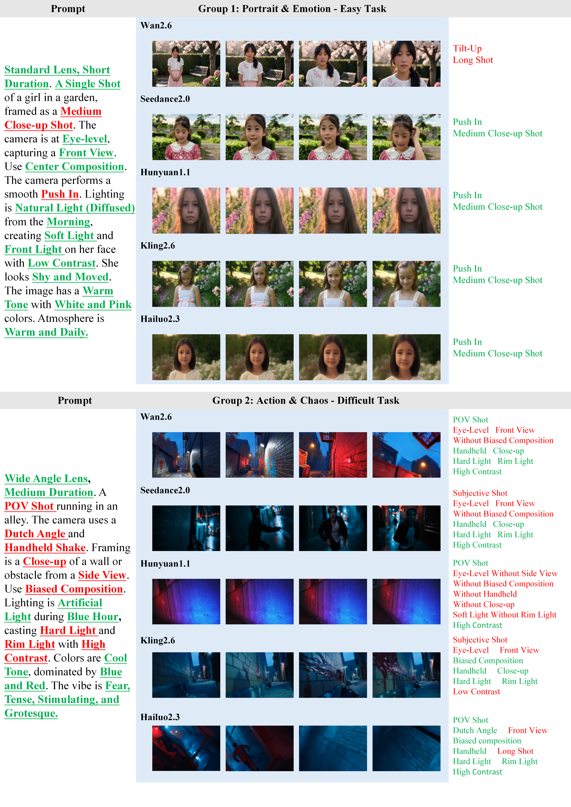

# CineBench

## 中文简介

CineBench 是一个面向电影语言理解与生成评测的双语基准（中文/英文），用于系统评估多模态大模型在镜头语言层面的能力，而不仅是内容识别能力。

- 数据规模：446 个连续视频片段（`movie` 375 + `AI` 71）
- 评测维度：Cinematography / Lighting / Color / Emotional Cue
- 题目规模：5,877 条多项选择题（论文版本）
- 资源组成：视频片段、双语 benchmark、训练/测试拆分表、可复现评测代码

## English Overview

CineBench is a bilingual benchmark (Chinese/English) for evaluating cinematic-language understanding and controllable generation in multimodal models.

- 446 contiguous clips (`movie`: 375, `AI`: 71)
- Four dimensions: Cinematography, Lighting, Color, and Emotional Cue
- 5,877 MCQA items in the paper version
- Reproducible assets: clips, bilingual benchmark tables, train/test splits, and evaluation pipeline

## Project Structure

- `AI/`: AI-generated clips
- `movie/`: movie clips
- `CineBench_en_train.xlsx`, `CineBench_en_test.xlsx`: English train/test benchmark tables
- `CineBench_zh_train.xlsx`, `CineBench_zh_test.xlsx`: Chinese train/test benchmark tables
- `CineBench_Supplementary Material.pdf`: paper supplementary material
- `pipeline/`: evaluation code and model adapters
- `docs/figures/`: key figures used in the paper

## Paper Figures

### Data Curation Workflow


### Benchmark Task Design


### Model Performance Snapshot


### Generation Examples


## Evaluation Quick Start

```bash
cd pipeline
python eval.py --model qwen --annotation_file cb_en_train.json --max_num_frames 16 --seed 42
```

For full evaluation details, see `pipeline/README.md`.
